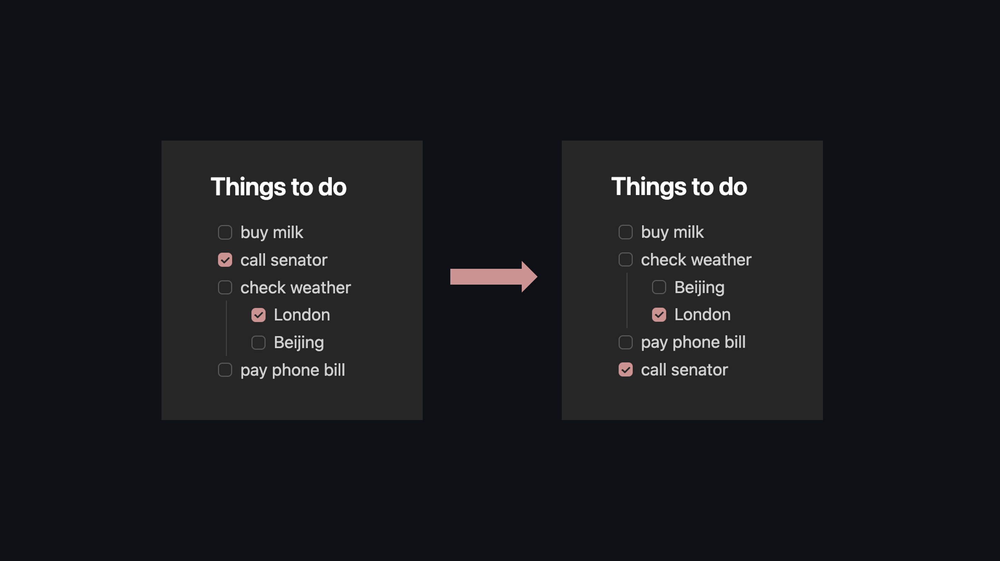

# Move Completed Tasks

An [Obsidian](https://obsidian.md) plugin that keeps your task lists tidy. When you check off a task it moves to the bottom of its group automatically, and a gentle highlight confirms where it landed. Undo with a single Ctrl+Z.

For pages that already have scattered completed tasks, two commands let you clean everything up at once.

## Install

**Community plugins:** Open Settings > Community plugins > Browse, search "Move Completed Tasks", click Install, then Enable. Or install directly via [this link](https://obsidian.md/plugins?id=move-completed-tasks).

**Manual:** Download `move-completed-tasks.zip` from the [latest release](https://github.com/aaronpenne/move-completed-tasks/releases/latest), unzip it into your vault's plugin folder (`<vault>/.obsidian/plugins/`), and enable in Settings > Community plugins.

**[BRAT](https://github.com/TfTHacker/obsidian42-brat):** Add `aaronpenne/move-completed-tasks` in BRAT settings.

## How it works

A "group" is any uninterrupted run of checkboxes at the same indent level. Groups end at blank lines, headings, code fences, or non-checkbox content.

When you complete a task:
1. The task (and its subtasks, if any) moves to the bottom of its group
2. A subtle highlight fades in at the new position so you don't lose track
3. The operation is atomic: one undo reverses it

Subtask completion stays scoped within the parent. A nested checkbox never escapes its parent's group.

## Commands

Open the command palette (Ctrl/Cmd+P) and search "Move completed":

| Command | Description |
|---------|-------------|
| **Move all completed tasks down (scoped)** | Partitions every group in the document: incomplete tasks stay on top, completed tasks sink to the bottom. Recurses into subtask groups. Preserves relative order. |
| **Collect all completed tasks to end of document** | Pulls all completed tasks out of the body and places them under a `## Completed` heading at the end of the note. |

Both commands can be bound to hotkeys in Settings > Hotkeys.

## Settings

| Option | Default | Description |
|--------|---------|-------------|
| Enable | On | Master toggle for the auto-move on check |
| Move with subtasks | On | Move nested items as a block with their parent |
| Placement | Above completed | Where newly completed tasks land: above other completed items (preserves a clear boundary), or absolute bottom of the group |
| Excluded characters | `?!*"lbiSIpcfkwud` | Checkbox characters that represent status rather than completion (Minimal theme decorators by default) |
| Highlight moved task | On | Show a brief visual indicator at the task's new position |
| Move delay | 0s | Seconds to wait before moving (0 = instant). Unchecking before the delay fires cancels the move. |

## Theme compatibility

Works with any theme that uses standard markdown checkboxes. Themes with alternative checkbox states (Minimal, AnuPpuccin, ITS Theme) are handled via the excluded characters setting. The default exclusion list covers all [Minimal theme](https://github.com/kepano/obsidian-minimal) decorators: `[?]` question, `[!]` important, `[*]` star, `["]` quote, `[l]` location, `[b]` bookmark, `[i]` info, `[S]` savings, `[I]` idea, `[p]` pros, `[c]` cons, `[f]` fire, `[k]` key, `[w]` win, `[u]` up, `[d]` down.

## Plugin compatibility

- [Tasks](https://github.com/obsidian-tasks-group/obsidian-tasks): moves happen after the Tasks plugin appends done-dates, so timestamps are preserved
- [Dataview](https://github.com/blacksmithgu/obsidian-dataview): no conflicts (Dataview reads, this plugin writes)

## Why this plugin

Apps like Apple Notes, Noteplan, and Todoist automatically sink completed tasks to the bottom of their list the moment you check them off. This plugin brings that same behavior to Obsidian. It does one thing and stays out of the way.

Several other plugins overlap in scope but solve different problems:

- [Tasks](https://github.com/obsidian-tasks-group/obsidian-tasks) — full task management with dates, recurrence, and queries
- [Completed Task Display](https://github.com/heliostatic/completed-task-display) — hides completed tasks via CSS rather than moving them
- [Todo Sort](https://github.com/ryangomba/obsidian-todo-sort) — sorts tasks on file open rather than on completion
- [Task Mover](https://github.com/thomascherickal/obsidian-task-mover) — moves completed tasks to a separate file or heading
- [Archiver](https://github.com/ivan-lednev/obsidian-task-archiver) — archives completed tasks to a designated section or separate file
- [To-Do to Done Mover](https://github.com/Quorafind/Obsidian-Todo-Done-Mover) — moves done tasks between specific headings
- [DoneDrop](https://github.com/McMasterJoey/DoneDrop-Obsidian-Plugin) — drops completed tasks to the bottom of the note
- [Move Completed Tasks Down](https://github.com/optimummost001/move-completed-tasks-down) — similar concept with a fixed 5-second delay and file-level diffing

## License

[MIT](LICENSE)
